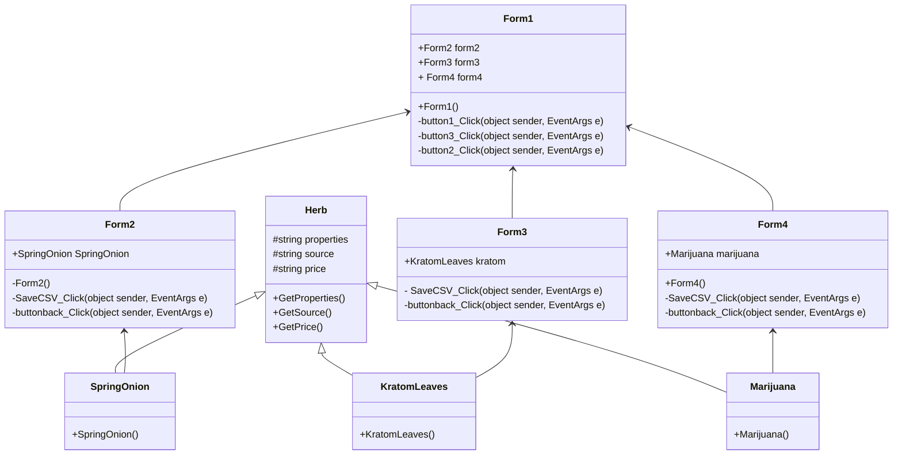

### ความเป็นมา 
อยากแนะนำสรรพคุณของสมุนไพรที่น่าจะมีประโยชน์สำหรับผู็ที่ต้องการศึกษามัน เพราะสมุนไพรบางชนิดบางคนอาจมองมัน
เป็นแค่พืช มองเป็นสารเสพติด มองเป็นแค่ต้นไม้ต้นหนึ่ง แต่ บางทีพืชที่คุณอาจจะมองข้ามอาจมีประโยชน์มากมากจนคุณคิดไม่ถึง
### วัตถุประสงค์
เพื่อแนะนำสรรคุณของพืชสมุนไพร
เพื่อบงบอกแหล่งที่มาของพืชสมุนไพร
เพื่อบอกข้อมูลเพื่อเพิ่มความรู้ของพืชสมุนไพรนั้นๆ
### โครงสร้างโปรแกรม

### ผู้พัฒนาโปรแกรม
นาย รัชชานนท์ ค้ำชู รหัสนักศึกษา 663450178-3

